# Todo-App - Comprehensive Documentation: Day Care

A modern, cross-platform Todo application built with Flutter that supports task management, calendar events, user authentication, and multi-platform deployment.

This project is focused on android and desktop application development. Please check the app-release.apk for android, and desktop-application.zip for desktop to manage time with Day Care.


## Table of Contents
0. [Screenshots](#screenshots)
1. [Initial Setup](#initial-setup)
2. [Installation Guide](#installation-guide)
3. [Project Structure](#project-structure)
4. [Code Implementation](#code-implementation)
5. [Features Overview](#features-overview)
6. [Deployment](#deployment)
7. [Screenshots](#screenshots)

## Screenshots

### Android Application
Here are the snippets of the andorid application in dark view: Please install app-release.apk in android to play with the app: 

<div align="center">

| 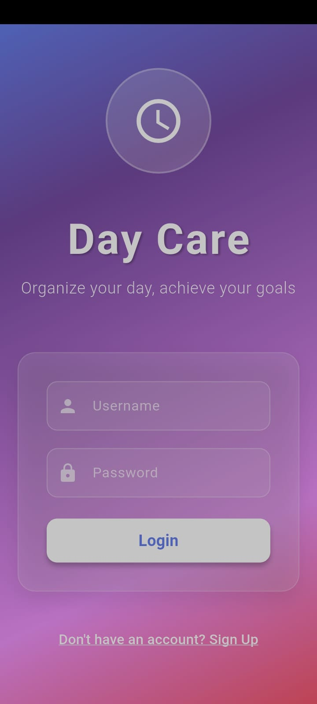 | 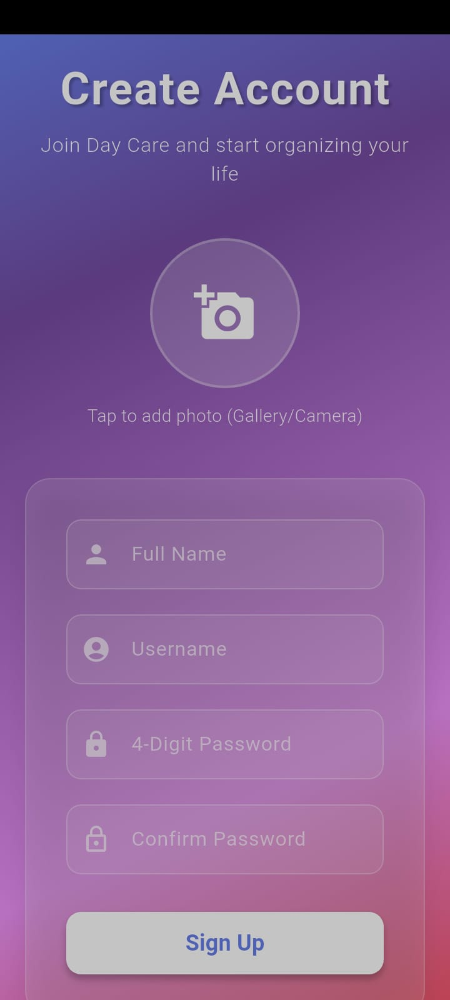 | 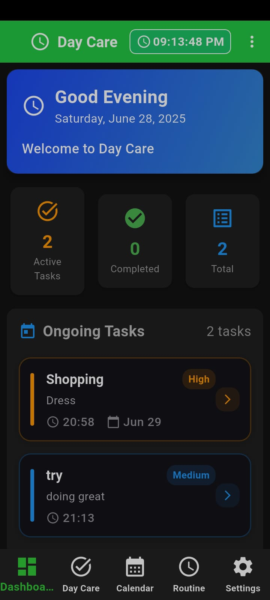 |
|:---:|:---:|:---:|
| **Login Screen** | **Signup Screen** | **Home Dashboard** |

| 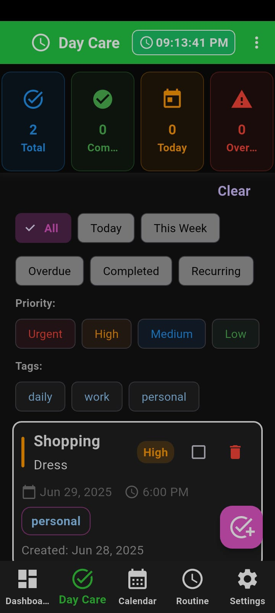 | 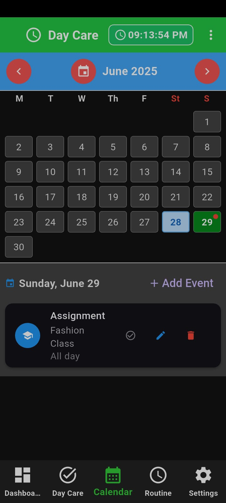 | 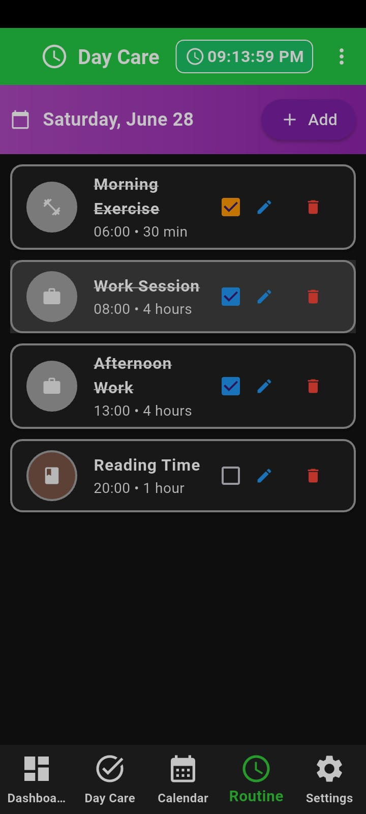 |
|:---:|:---:|:---:|
| **Task Management** | **Calendar View** | **Daily Routine** |

| 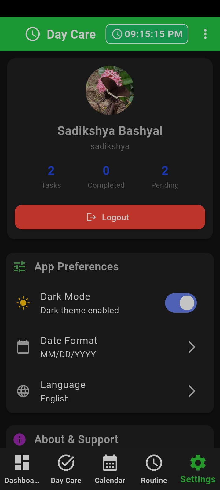 | 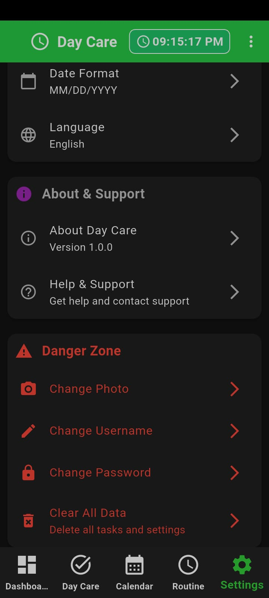 | |
|:---:|:---:|:---:|
| **Settings View 1** | **Settings View 2** | |

</div>

### Desktop Application
Below is the snippets of the Desktop Application in Light mode. Please download desktop-application.zip file and run .exe file to play with the application.

<div align="center">

| 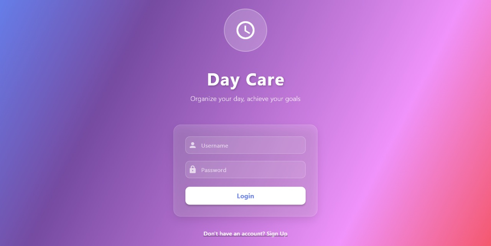 | 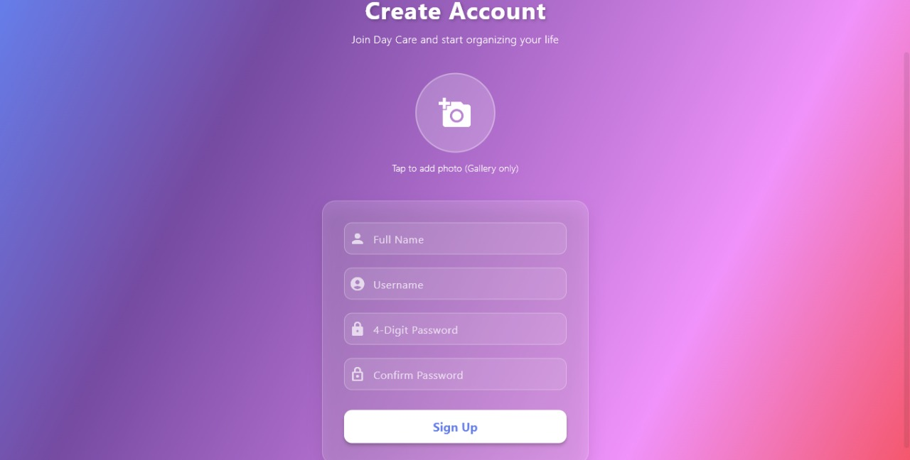 |
|:---:|:---:|
| **Login Screen** | **Sign Up Screen** |

| 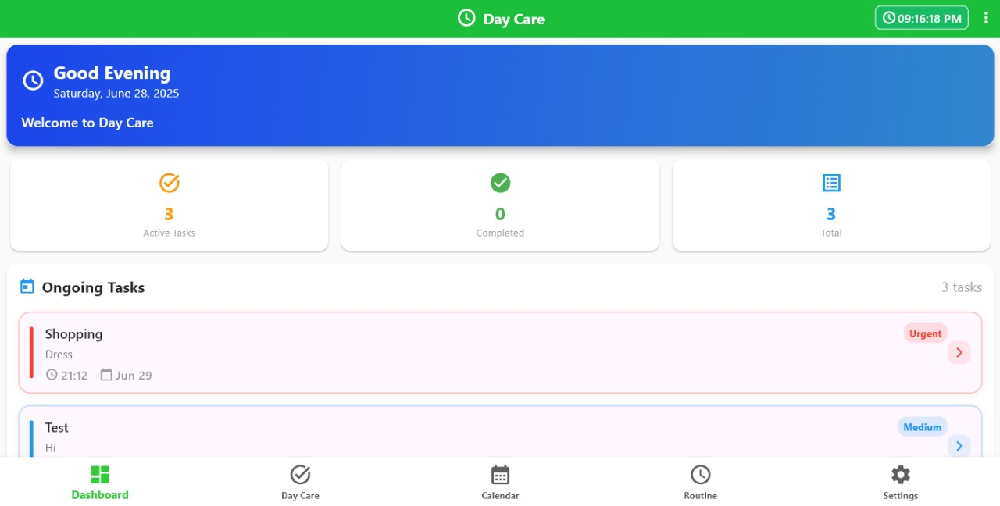 | 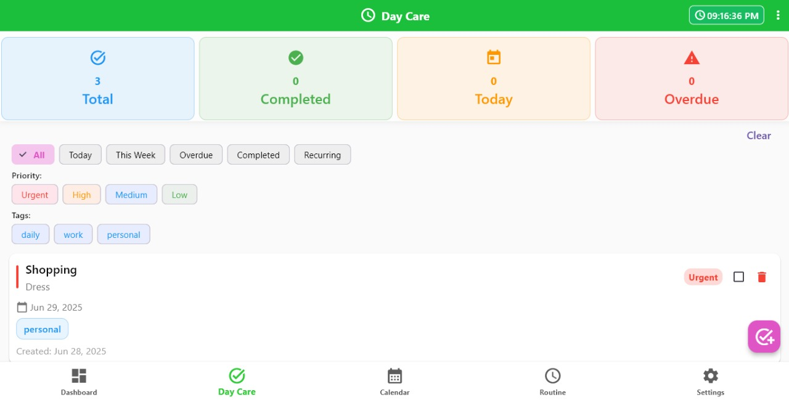 |
|:---:|:---:|
| **Home Dashboard** | **Task Management** |

| 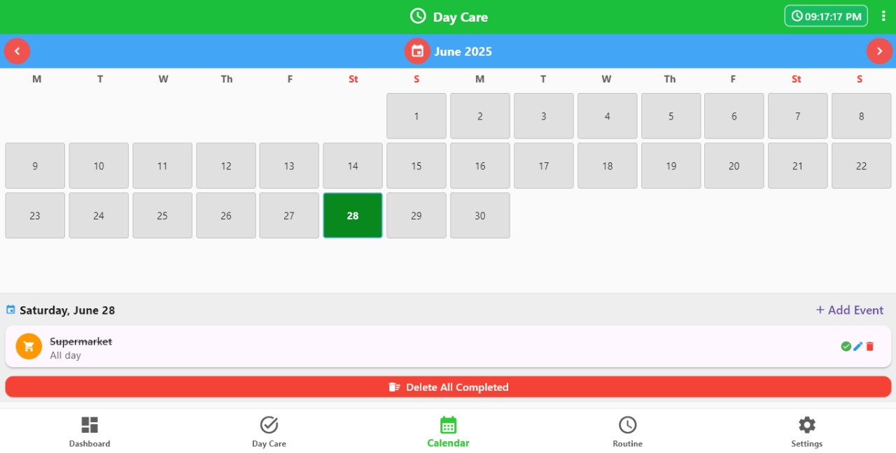 |  |
|:---:|:---:|
| **Calendar View** | **Daily Routine** |

| 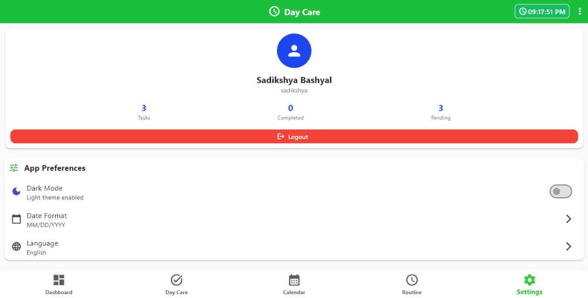 | |
|:---:|:---:|
| **Settings Page** | |

</div>

## Initial Setup
If you are new to cross-patform application development, below is a guide that will help you understand how to get started with Flutter:

### Prerequisites
- Windows 10/11 (for this setup)
- Git installed
- At least 8GB RAM recommended
- 10GB free disk space

### Flutter Installation

1. **Download Flutter SDK**
   - Visit: https://docs.flutter.dev/get-started/install/windows/mobile
   - Download the stable version for Windows
   - Extract to `C:\flutter` (recommended path)

2. **Environment Variables Setup**
   - Open System Properties → Advanced → Environment Variables
   - Add `C:\flutter\bin` to the PATH variable
   - Restart your terminal/PowerShell

3. **Verify Installation**
   ```bash
   flutter doctor
   ```
   This command will check your setup and guide you through any missing dependencies.

4. **Install Dependencies**
   - Install Android Studio for Android development
   - Install VS Code with Flutter extension for web/desktop development
   - Install Git for version control

5. **Useful terminal code for setup**
```bash
#Installation
flutter create todo
cd todo
flutter pub get

# Android Run in VS Code
flutter emulators # to show the number of emulators, once you have installed andoird Studio for this, it will work
flutter emulators --launch Emulator_ID
flutter run --debug

# Desktop Application
flutter run -d windows

# Chrome Application
flutter run -d chrome
```

## Installation Guide

### 1. Clone and Setup Project
```bash
# Clone the repository
git clone https://github.com/SadikshyaBashyal/Todo-App.git
cd Todo-App

# Navigate to Flutter project
cd todo

# Install dependencies
flutter pub get

# Run the application
flutter run
```

### 2. Platform-Specific Setup

#### Web Development (VS Code)
```bash
# Enable web support
flutter config --enable-web

# Run web version
flutter run -d chrome
```

#### Desktop Development (VS Code)
```bash
# Enable desktop support
flutter config --enable-windows-desktop
flutter config --enable-macos-desktop
flutter config --enable-linux-desktop

# Run desktop version
flutter run -d windows
```

#### Android Development (Android Studio)
```bash
# Enable Android support
flutter config --enable-android

# Run Android version
flutter run -d android
```

## Project Structure

```
Todo-App/
├── todo/                          # Main Flutter project
│   ├── lib/                       # Source code directory
│   │   ├── main.dart             # Application entry point
│   │   ├── models/               # Data models
│   │   │   ├── todo.dart         # Todo item model
│   │   │   ├── event.dart        # Calendar event model
│   │   │   └── user.dart         # User model
│   │   ├── providers/            # State management
│   │   │   ├── todo_provider.dart # Main state provider
│   │   │   └── theme_provider.dart # Theme management
│   │   ├── screens/              # UI screens
│   │   │   ├── lichal_front_page.dart # Landing page
│   │   │   ├── login_screen.dart # Login interface
│   │   │   ├── signup_screen.dart # Registration interface
│   │   │   ├── home_screen.dart  # Main dashboard
│   │   │   ├── dashboard_screen.dart # Task overview
│   │   │   ├── all_tasks_screen.dart # All tasks view
│   │   │   ├── calendar_screen.dart # Calendar view
│   │   │   ├── daily_routine_screen.dart # Daily routine
│   │   │   ├── timeline_screen.dart # Timeline view
│   │   │   ├── task_detail_screen.dart # Task details
│   │   │   └── settings_screen.dart # Settings
│   │   ├── widgets/              # Reusable UI components
│   │   │   ├── main_navigation.dart # Navigation bar
│   │   │   ├── add_todo_dialog.dart # Add task dialog
│   │   │   ├── edit_todo_dialog.dart # Edit task dialog
│   │   │   ├── todo_item.dart    # Individual task item
│   │   │   ├── event_dialog.dart # Event management dialog
│   │   │   └── auth_widgets.dart # Authentication widgets
│   │   ├── utils/                # Utility functions
│   │   │   └── auth_utils.dart   # Authentication utilities
│   │   ├── helpers/              # Helper functions
│   │   │   └── image_helper.dart # Image handling
│   │   └── styles/               # App styling
│   │       └── app_styles.dart   # Theme and styles
│   ├── assets/                   # Static assets
│   │   └── icon/                 # App icons
│   ├── android/                  # Android-specific code
│   ├── ios/                      # iOS-specific code
│   ├── web/                      # Web-specific code
│   ├── windows/                  # Windows-specific code
│   ├── macos/                    # macOS-specific code
│   ├── linux/                    # Linux-specific code
│   └── pubspec.yaml             # Dependencies and configuration
├── images/                       # Documentation images
├── app-release.apk              # Android release build
├── desktop-application.zip      # Desktop release build
└── README.md                    # This documentation
```

## Code Implementation

### 1. Data Models

#### Todo Model (`lib/models/todo.dart`)
- **Purpose**: Defines the structure for todo items
- **Key Features**:
  - Priority levels (urgent, high, medium, low)
  - Recurring task support (daily, weekly, custom)
  - Due date and time management
  - Tag system for categorization
  - Completion tracking


#### Event Model (`lib/models/event.dart`)
- **Purpose**: Manages calendar events
- **Features**: Event scheduling, reminders, and calendar integration

#### User Model (`lib/models/user.dart`)
- **Purpose**: User authentication and profile management
- **Features**: Multi-user support, profile data storage

### 2. State Management

#### TodoProvider (`lib/providers/todo_provider.dart`)
- **Purpose**: Central state management for the application
- **Key Responsibilities**:
  - CRUD operations for todos and events
  - User authentication state
  - Data persistence using SharedPreferences
  - Filtering and sorting functionality
  - Multi-user support


#### ThemeProvider (`lib/providers/theme_provider.dart`)
- **Purpose**: Manages application theming
- **Features**: Light/dark mode switching, custom color schemes

### 3. User Interface

#### Authentication Flow
1. **LichalFrontPage** (`lib/screens/lichal_front_page.dart`)
   - Landing page with login/signup options
   - Modern UI with animations

2. **Login/Signup Screens**
   - User authentication interface
   - Form validation and error handling

#### Main Application
1. **MainNavigation** (`lib/widgets/main_navigation.dart`)
   - Bottom navigation bar
   - Screen routing and state management

2. **Home Screen** (`lib/screens/home_screen.dart`)
   - Dashboard with task overview
   - Quick actions and statistics

3. **Task Management Screens**
   - **AllTasksScreen**: Complete task list with filtering
   - **TaskDetailScreen**: Detailed task view and editing
   - **DailyRoutineScreen**: Daily task organization

4. **Calendar Integration**
   - **CalendarScreen**: Monthly calendar view
   - **TimelineScreen**: Chronological task view

### 4. Key Features Implemented

#### Task Management
- ✅ Create, edit, delete tasks
- ✅ Priority levels and due dates
- ✅ Recurring tasks (daily, weekly, custom)
- ✅ Tag-based categorization
- ✅ Task completion tracking

#### User System
- ✅ Multi-user support
- ✅ User authentication
- ✅ Profile management
- ✅ Data isolation per user

#### Calendar Integration
- ✅ Calendar event creation
- ✅ Event scheduling and reminders
- ✅ Timeline view
- ✅ Daily routine management

#### Data Persistence
- ✅ Local storage using SharedPreferences
- ✅ User-specific data isolation
- ✅ Automatic data synchronization

#### UI/UX Features
- ✅ Responsive design
- ✅ Theme switching (light/dark)
- ✅ Modern Material Design
- ✅ Smooth animations
- ✅ Cross-platform compatibility

## Features Overview

### Core Functionality
1. **Task Management**
   - Create, edit, and delete tasks
   - Set priorities and due dates
   - Add descriptions and tags
   - Mark tasks as complete

2. **Recurring Tasks**
   - Daily, weekly, or custom recurrence
   - End date specification
   - Automatic task generation

3. **Calendar Integration**
   - Monthly calendar view
   - Event scheduling
   - Timeline visualization

4. **User Management**
   - Multi-user support
   - User authentication
   - Profile customization

5. **Data Persistence**
   - Local storage
   - User-specific data
   - Automatic synchronization

### Advanced Features
- **Priority System**: Urgent, High, Medium, Low priorities
- **Tag System**: Categorize tasks with custom tags
- **Filtering**: Filter by date, priority, tags, completion status
- **Search**: Find tasks quickly
- **Statistics**: Task completion analytics
- **Themes**: Light and dark mode support

## Deployment

### Android Deployment
```bash
# Build APK
flutter build apk --release --no-tree-shake-icons

# Build App Bundle (recommended for Play Store)
flutter build appbundle --release
```

### Web Deployment (GitHub Pages)
```bash
# Build web version
flutter build web --release

# Deploy to GitHub Pages
# 1. Create a new repository or use existing one
# 2. Build the web version
flutter build web --release

# 3. Navigate to build/web directory
cd build/web

# 4. Initialize git and push to GitHub Pages branch
git init
git add .
git commit -m "Deploy to GitHub Pages"
git branch -M main
git remote add origin https://github.com/YOUR_USERNAME/YOUR_REPO_NAME.git
git push -u origin main

# 5. Enable GitHub Pages in repository settings:
# - Go to Settings > Pages
# - Source: Deploy from a branch
# - Branch: main
# - Folder: / (root)
```

#### Automatic Deployment with GitHub Actions
The project includes a GitHub Actions workflow for automatic deployment:

1. **Workflow File**: `.github/workflows/deploy.yml`
2. **Trigger**: Automatically runs on push to `main` branch
3. **Deployment Branch**: `gh-pages`
4. **Setup**:
   - Push your code to the `main` branch
   - Go to repository Settings > Pages
   - Source: Deploy from a branch
   - Branch: `gh-pages`
   - Folder: `/ (root)`

The workflow will:
- Build the Flutter web app
- Deploy to `gh-pages` branch
- Make app available at: `https://sadikshyabashyal.github.io/Todo-App`

### Desktop Deployment
```bash
# Windows
flutter build windows --release
```

### Release Files
- `app-release.apk`: Android application package
- `desktop-application.zip`: Desktop application bundle

## Development Workflow

### Recommended Development Environment
1. **VS Code** with Flutter extension for web/desktop development
2. **Android Studio** for Android development
3. **Git** for version control

### Code Organization
- **Models**: Data structures and business logic
- **Providers**: State management and data operations
- **Screens**: Main UI pages
- **Widgets**: Reusable UI components
- **Utils/Helpers**: Utility functions and helpers

### Best Practices Implemented
- Separation of concerns
- Provider pattern for state management
- Responsive design principles
- Cross-platform compatibility
- Local data persistence
- User authentication security

## Conclusion

This Todo-App is a comprehensive, production-ready application that demonstrates modern Flutter development practices. It includes user authentication, task management, calendar integration, and cross-platform deployment capabilities. The codebase is well-organized, maintainable, and follows Flutter best practices.

For development, focus on the `lib/` directory where all the main application code resides. This project is focused on android and desktop application development. The platform-specific directories (`android/`, `ios/`, `web/`, etc.) contain configuration files for each platform deployment. 

## Coded with AI
This project was developed with the assistance of AI tools to create a comprehensive Todo application. The AI was used to:
- For creation of the template to my ideas
- Search for the various errors and learn about them 
- Used for documentation template in ReadMe


