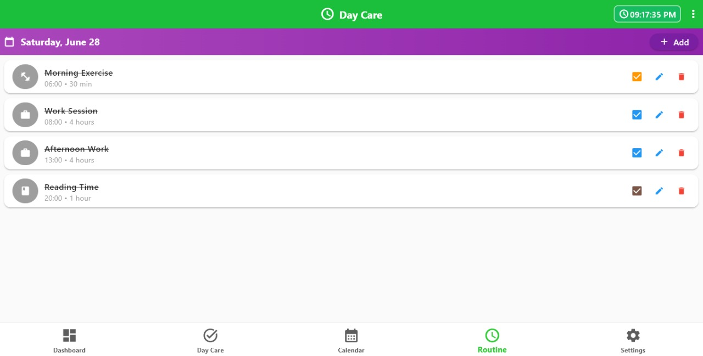

# Todo-App - Comprehensive Documentation: Day Care

A modern, cross-platform Todo application built with Flutter that supports task management, calendar events, user authentication, and multi-platform deployment.

This project is focused on android and desktop application development. Please check the app-release.apk for android, and desktop-application.zip for desktop to manage time with Day Care.


## Table of Contents
- [How I made it](#how-I-made-it)
0. [Screenshots](#screenshots)
1. [Initial Setup](#initial-setup)
2. [Installation Guide](#installation-guide)
3. [Features Overview](#features-overview)
4. [Deployment](#deployment)

## How I made it

Before starting, all the steps and codes are given below. Please follow the steps to run in android. I wanted to work on the cross-platform project, and that's why I started project in Flutter. I don't know how to get started so I followed the tutorial to install and initialize the flutter template. However, I don't have android emulator so, I installed Android Studio to use one of their emulators and debug while coding. I had created the models to define the structure of the todo tasks, events and user models. I had a vision on how to keep things together and during coding my ideas got more clear and I could deliver more of it. Obviously, I took more time than the hackatime showed, to learn from documentation to code and debug the code, took help from AI to incubate the ideas more. 

## Screenshots

### Android Application
Here are the snippets of the andorid application in dark view: Please install app-release.apk in android to play with the app: 

<div align="center">

|  |  |  |
|:---:|:---:|:---:|
| **Login Screen** | **Signup Screen** | **Home Dashboard** |

|  |  |  |
|:---:|:---:|:---:|
| **Task Management** | **Calendar View** | **Daily Routine** |

|  |  | |
|:---:|:---:|:---:|
| **Settings View 1** | **Settings View 2** | |

</div>

### Desktop Application
Below is the snippets of the Desktop Application in Light mode. Please download desktop-application.zip file and run .exe file to play with the application.

<div align="center">

|  |  |
|:---:|:---:|
| **Login Screen** | **Sign Up Screen** |

|  |  |
|:---:|:---:|
| **Home Dashboard** | **Task Management** |

|  |  |
|:---:|:---:|
| **Calendar View** | **Daily Routine** |

|  | |
|:---:|:---:|
| **Settings Page** | |

</div>

## Initial Setup
Here is the complete guide to start project in Flutter. 

### Prerequisites
- Windows 10/11 (for this setup)
- Git installed
- At least 8GB RAM recommended
- 10GB free disk space

### Flutter Installation

1. **Download Flutter SDK**
   - Visit: https://docs.flutter.dev/get-started/install/windows/mobile
   - Download the stable version for Windows
   - Extract to `C:\flutter` (recommended path)

2. **Environment Variables Setup**
   - Open System Properties → Advanced → Environment Variables
   - Add `C:\flutter\bin` to the PATH variable
   - Restart your terminal/PowerShell

3. **Verify Installation**
   ```bash
   flutter doctor
   ```
   This command will check your setup and guide you through any missing dependencies.

4. **Install Dependencies**
   - Install Android Studio for Android development
   - Install VS Code with Flutter extension for web/desktop development
   - Install Git for version control

5. **Useful terminal code for setup**
```bash
#Installation
flutter create todo
cd todo
flutter pub get

# Android Run in VS Code
flutter emulators # to show the number of emulators, once you have installed andoird Studio for this, it will work
flutter emulators --launch Emulator_ID
flutter run --debug

# Desktop Application
flutter run -d windows

# Chrome Application
flutter run -d chrome
```

## Installation Guide

### 1. Clone and Setup Project
```bash
# Clone the repository
git clone https://github.com/SadikshyaBashyal/Todo-App.git
cd Todo-App

# Navigate to Flutter project
cd todo

# Install dependencies
flutter pub get

# Run the application
flutter run
```

### 2. Platform-Specific Setup

#### Web Development (VS Code)
```bash
# Run web version
flutter run -d chrome
```

#### Desktop Development (VS Code)
```bash
# Enable desktop support
flutter config --enable-windows-desktop
flutter config --enable-macos-desktop
flutter config --enable-linux-desktop

# Run desktop version
flutter run -d windows
```

#### Android Development (Android Studio)
```bash
flutter emulators -d
flutter emulators --lanuch Medium_Phone_API_36.0
flutter run --debug
```

## Features Overview

### Core Functionality
1. Create, edit and delete tasks, priorities, tags, due dates and many more.
2. Recur tasks as per your need
3. Update and see the calendar for upcoming events, birthdays and recur on your days.
4. Multi-User support saving data in local storage.

## Deployment

### Android Deployment
```bash
# Build APK
flutter build apk --release --no-tree-shake-icons
```

### Desktop Deployment
```bash
# Windows
flutter build windows --release
```

### Release Files
- `app-release.apk`: Android application package
- `desktop-application.zip`: Desktop application bundle

### Web Deployment (GitHub)
```bash
# Deploy to GitHub Pages
# 1. Create a new repository or use existing one
# 2. Build the web version
flutter build web --release

# 3. Push to GitHub Pages branch
git add .
git commit -m "Deploy"
git push -u origin main

# 4. Enable GitHub Pages in repository settings:
# - Go to Settings > Pages
# - Source: Deploy from a branch
# - Branch: main
# - Folder: / (root)
```
The project includes a GitHub Actions workflow for automatic deployment:

1. **Workflow File**: `.github/workflows/deploy.yml`
2. **Trigger**: Automatically runs on push to `main` branch
3. **Deployment Branch**: `gh-pages`
4. **Setup**:
   - Push your code to the `main` branch
   - Go to repository Settings > Pages
   - Source: Deploy from a branch
   - Branch: `gh-pages`
   - Folder: `/ (root)`

The workflow includes:
- Built the Flutter web app
- Deployed to `gh-pages` branch
- Made available in: `https://sadikshyabashyal.github.io/Todo-App`

## Coded with AI
This project was developed with the assistance of AI tools to create a comprehensive Todo application. The AI was used to:
- For creation of the template to my ideas
- Search for the various errors and learn about them 
- Used for Project Structure in ReadMe


